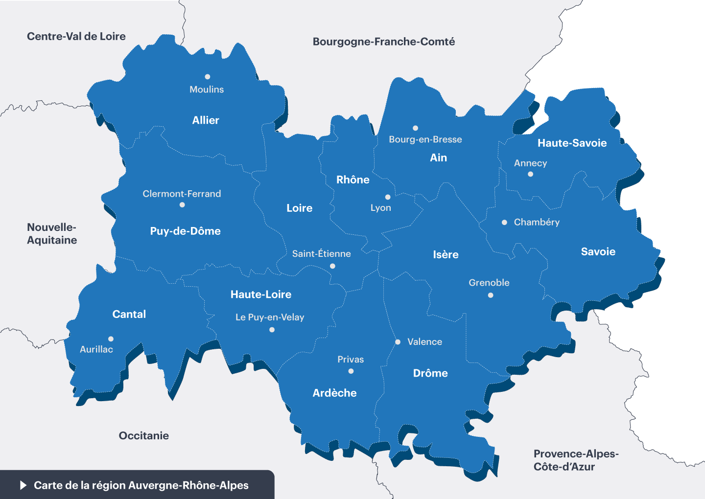

# La région Auvergne Rhône Alpes

La région ***Auvergne Rhône Alpes*** est une région dynamique, située au *centre-est de la France*.

Elle est composée de 12 départements, dont la [Drôme](mon-departement.md), et compte plus de 8 millions d'habitants.

## Emploi et économie

Cette région est une des plus attractives au niveau de l'emploi, et de nombreuses entreprises y sont implantées.

En Auvergne Rhône Alpes, 71% des 20 - 64 ans occupent un emploi, ce taux est supérieur à la moyenne européenne !

Sa proximité avec la Suisse 🇨🇭 et l'Italie 🇮🇹 en font un *carrefour économique important*, et de nombreux échanges ont lieu avec ces pays.

## Tourisme et nature

De nombreuses stations de ski :ski: en font une destination touristique privilégiée en hiver, et les nombreux parcs naturels permettent de profiter de la nature en toute saison.

Du massif central aux alpes, en passant par les monts du Lyonnais et le Vercors *(haut lieu de la résistance)*, la région est riche en paysages variés et en richesses historiques.

>**Le saviez-vous ?**
>
>Bien que dans la même région, les villes d'Annecy et Aurillac sont distantes de 275 km à vol d'oiseau. Cependant il ne faut pas moins de 8 heures de train pour les relier. :train2:

➡️ [Retour à l'accueil](index.md) ➡️ [Valence](ma-ville.md) ➡️ [La Drôme](mon-departement.md)
