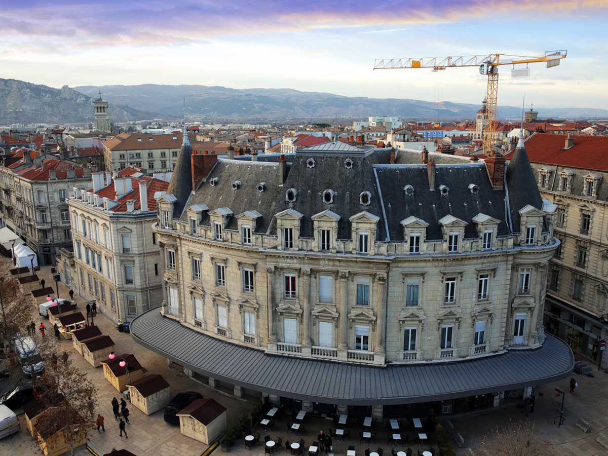
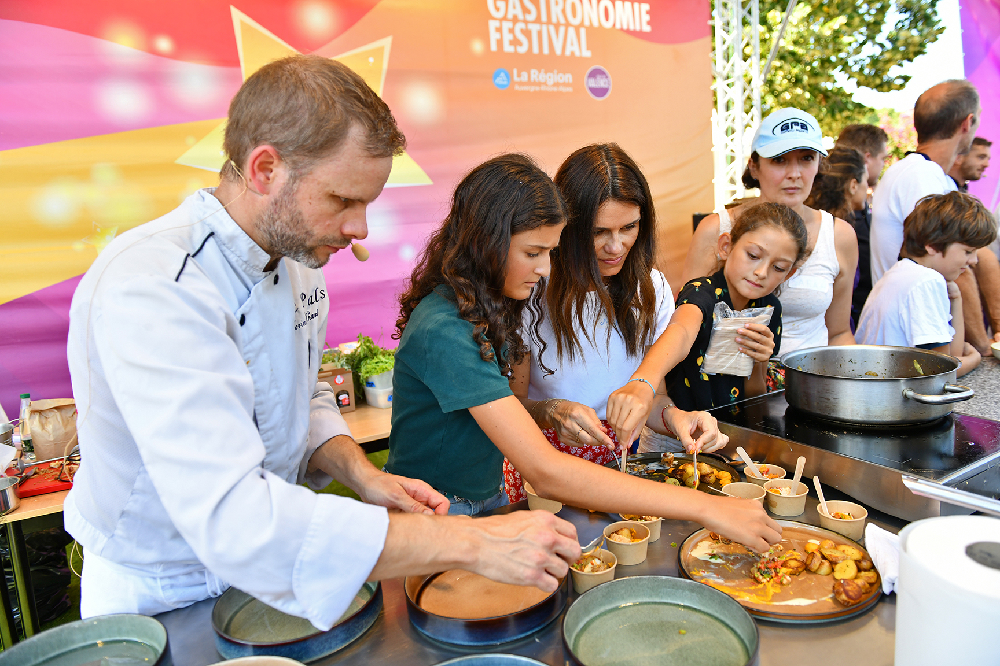
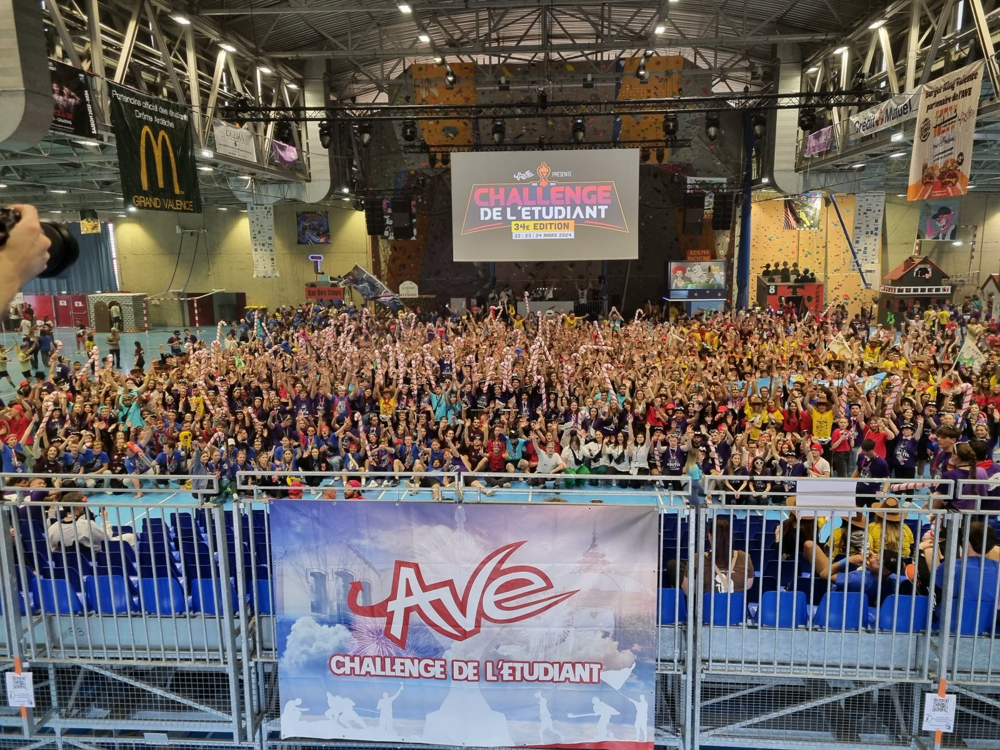

# Valence

Préfécture de la [Drôme](mon-departement.md), ***Valence*** est une ville moyenne de 63 000 habitants appartenant à la région [Rhône Alpes](ma-region.md). Elle est située à 100 km au sud de Lyon et à 150 km au nord de Marseille.

Au bord du Rhône, ***Valence*** est une ville agréable, avec un centre historique piétonnier, de nombreux parcs et jardins, ainsi que des commerces variés.

## Une ville idéalement située

Très bien desservie par l'autoroute A7, le TGV qui place ***Valence*** à 2h30 de Paris et à 25 minutes de Lyon, c'est une ville facile d'accès.

Bien souvent associée aux bouchons et aux difficultés de circulation, peu de personnes prennent le temps de s'arrêter, pour découvrir la ville et ses alentours.

Dynamique et situé dans un bassin d'emploi important, la ville de ***Valence*** organise de nombreux événements culturels et sportifs tout au long de l'année.

## La gastronomie

Valence, c'est aussi la capitale de la gastronomie. Avec la présence de nombreux chefs étoilés, la ville est réputée pour sa cuisine raffinée et ses produits locaux.

D'***Anne Sophie Pic***, en passant par ***Michel Chabran***, ou encore ***Baptise Poinot***, les grands noms étoilés de la cuisine française sont présents à Valence.

>**Le saviez-vous ?**
>
>En 1968, alors qu'il déjeunait *chez Pic*, à Valence, le peintre espagnol ***Salvador Dali*** a été victime d'une mésaventure. Il s'est fait dérober sa Cadillac qui contenait trois tableaux ainsi que des bijoux.

## Une ville dynamique

Du Rallye Monte Carlo historique, au festival de la gastronomie, en passant par les différentes courses cyclistes et les concerts, il y en a pour tous les goûts.

***Valence*** est également une ville étudiante, avec un campus universitaire important qui compte de nombreuses écoles supérieures de lettres et droit, ainsi que des STAPS et d'ingénieurs.

De fait, la ville est jeune et de nombreuses activités sont organisées pour les étudiants, dont le désormais célèbre *Challenge de l'Etudiant* que les autres villes de France nous envient. Il s'agit d'une compétition sportive qui se déroule sur un week-end, et qui permet aux étudiants de se rencontrer et de s'affronter dans la bonne humeur.

➡️ [Retour à l'accueil](index.md) ➡️ [La Drôme](mon-departement.md) ➡️ [La région ARA](ma-region.md)
