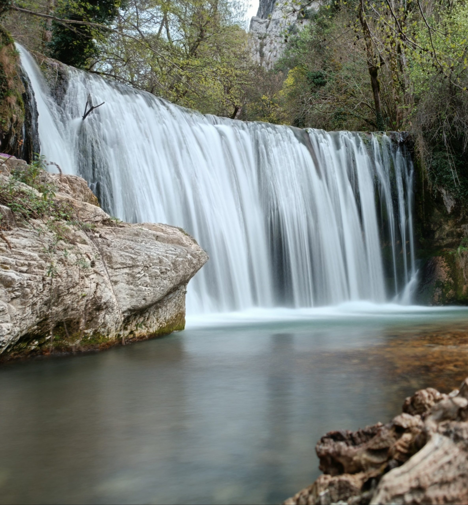
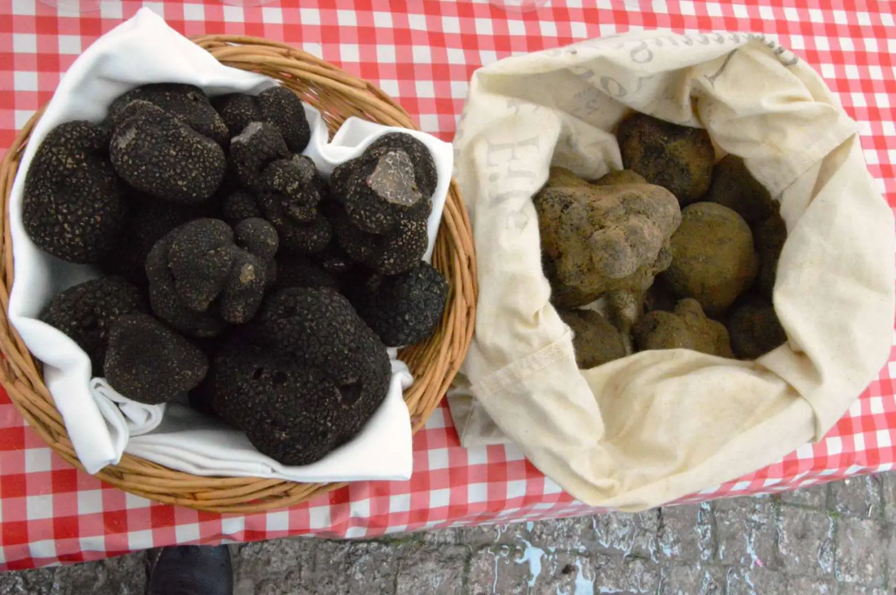
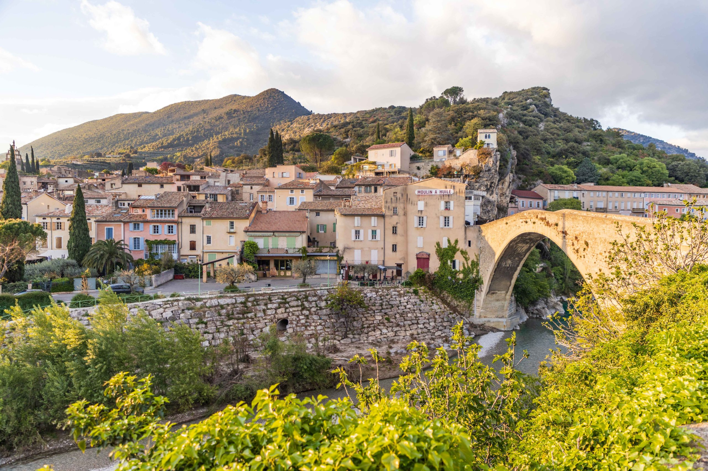

# La Drôme

Situé entre mer et montagne, le ***département de la Drôme*** bénéficie d'une situation idéale pour les amoureux de la nature.

Que ce soit dans le *massif du Vercors*, le *Diois*, le *pays de Nyons* ou encore la *Drôme provençale*, vous trouverez de nombreuses balades et randonnées à effectuer entre amis ou en famille.

## Les villes principales

Le département de la Drôme compte plusieurs villes importantes, parmi lesquelles :

- [Valence](ma-ville.md)
- Montélimar
- Romans-sur-Isère
- Die

## Les spécialités culinaires

Parce que la Drôme est aussi un département gourmand, vous pourrez y déguster de nombreuses spécialités culinaires. Parmi elles, on retrouve notamment :

- La pogne de Romans
- La raviole du Dauphiné
- La caillette
- La truffe noire
- La Clairette de Die

On parle aussi fréquemment du Suisse de Valence, une spécialité de la ville de [Valence](ma-ville.md). Mais de vous à moi, personne n'aime vraiment ça...

>**Le saviez-vous ?**
>
>Dans l’Album Blanc des Beatles, Montélimar est mis à l’honneur dans la chanson “Savoy truffle”. Le nom de la ville est associé au nougat.

## La Drôme provençale

La Drôme provençale est une région du département de la Drôme qui s'étend sur une partie du sud du département. Elle est caractérisée par ses champs de lavande, ses villages perchés et ses marchés provençaux.

➡️ [Retour à l'accueil](index.md) ➡️ [Valence](ma-ville.md) ➡️ [La région ARA](ma-region.md)
